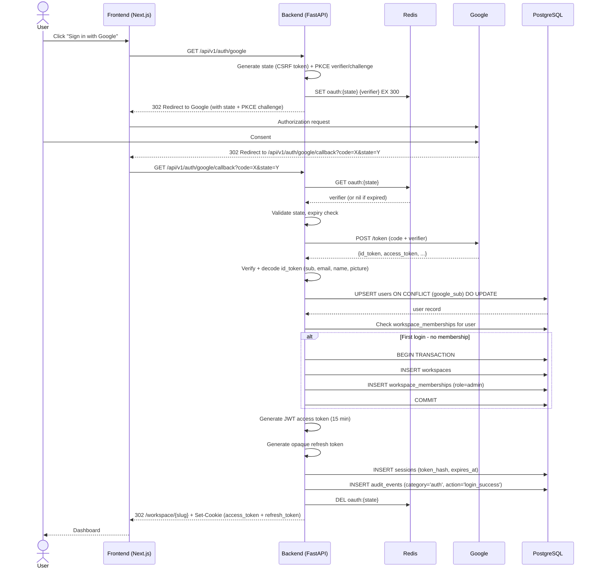
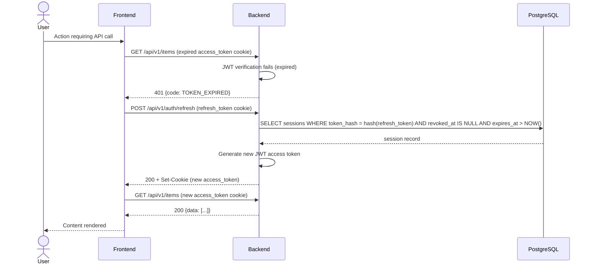
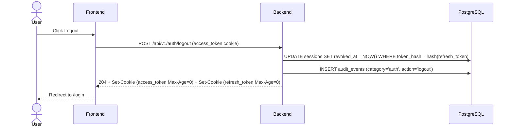

# EP-00 Technical Design — Access, Identity & Bootstrap

## Architecture Decisions

### AD-01: Session Strategy — JWT + Refresh Token (not pure server-side sessions)

**Decision**: Stateless JWT access token (15 min) + opaque refresh token stored server-side (30 days).

**Rationale**: Pure server-side sessions require Redis lookups on every request — fine, but it ties every auth check to Redis availability. Pure stateless JWTs can't be revoked without a denylist. The hybrid approach gives us:
- Short-lived JWT for low-latency auth checks (no Redis hit on every request)
- Server-stored refresh token for revocation capability (logout, account suspension)
- Redis-backed denylist only needed for emergency token invalidation, not routine checks

**Rejected alternatives**:
- Pure server-side sessions: every request hits Redis; not worth the coupling for auth checks
- Long-lived JWTs (hours/days): irrevocable — one leaked token is a problem for the full TTL

### AD-02: Cookie Strategy — HTTP-only, Secure, SameSite=Lax

**Decision**: Two cookies. `access_token` (15 min, all paths). `refresh_token` (30 days, path restricted to `/api/v1/auth/refresh`).

**Rationale**: Restricting refresh token to its own path prevents it from being sent on every API request, reducing exposure. HTTP-only blocks XSS access. SameSite=Lax protects against CSRF on state-mutating requests (POST/PUT/DELETE) while allowing top-level navigation GET requests from OAuth redirects.

**Note**: CSRF protection is still needed for non-GET endpoints. Add `X-Requested-With: XMLHttpRequest` check or a double-submit cookie as a defense-in-depth measure.

### AD-03: PKCE for OAuth Flow

**Decision**: Implement PKCE (code_challenge_method=S256). State parameter for CSRF. Both stored in Redis with 5-min TTL.

**Rationale**: PKCE prevents authorization code interception attacks. Required for public clients (browser-initiated flows) by OAuth 2.1 draft. Not optional.

### AD-04: User Resolution — Google `sub` as Primary External Key

**Decision**: Resolve users by `google_sub`, not by email.

**Rationale**: Email addresses can change; Google `sub` is stable for the account lifetime. Avoids account takeover via email reuse.

### AD-05: Workspace Bootstrap in Same Transaction as User Creation

**Decision**: On first login, user upsert + workspace creation + membership creation run in a single DB transaction.

**Rationale**: Eliminates partial state where user exists but has no workspace. If the transaction fails, the user retries login cleanly.

---

## Data Model

### `users`

```sql
CREATE TABLE users (
    id             UUID PRIMARY KEY DEFAULT gen_random_uuid(),
    google_sub     VARCHAR(255) UNIQUE NOT NULL,
    email          VARCHAR(255) UNIQUE NOT NULL,
    full_name      VARCHAR(255) NOT NULL,
    avatar_url     TEXT,
    status         VARCHAR(50) NOT NULL DEFAULT 'active', -- active | suspended | deleted
    is_superadmin  BOOLEAN NOT NULL DEFAULT FALSE,
    created_at     TIMESTAMPTZ NOT NULL DEFAULT NOW(),
    updated_at     TIMESTAMPTZ NOT NULL DEFAULT NOW()
);

-- Per db_review.md IDX-10: the UNIQUE constraints on google_sub and email already
-- create implicit unique B-tree indexes. Redundant explicit indexes were removed.
-- Lookups by google_sub (OAuth callback) and email (admin tools) use the UNIQUE index.
```

> **Security invariant**: `is_superadmin` is a global flag that crosses workspace boundaries.
> It is NOT a workspace capability — it lives on `users`, not `workspace_memberships`.
> Set only via CLI command (`python -m app.cli create-superadmin`) or environment bootstrap.
> There is NO API endpoint that sets `is_superadmin = true`. Exposing such an endpoint would
> make privilege escalation trivially exploitable via IDOR or logic bugs. This is non-negotiable.

### `sessions`

```sql
CREATE TABLE sessions (
    id              UUID PRIMARY KEY DEFAULT gen_random_uuid(),
    user_id         UUID NOT NULL REFERENCES users(id) ON DELETE CASCADE,
    token_hash      VARCHAR(64) NOT NULL UNIQUE, -- SHA-256 of the opaque refresh token
    expires_at      TIMESTAMPTZ NOT NULL,
    revoked_at      TIMESTAMPTZ,
    created_at      TIMESTAMPTZ NOT NULL DEFAULT NOW(),
    ip_address      INET,
    user_agent      TEXT
);

CREATE INDEX idx_sessions_user_id ON sessions(user_id);
-- Per db_review.md IDX-10: token_hash already has an implicit unique index from the
-- UNIQUE column constraint. Redundant explicit index removed.
CREATE INDEX idx_sessions_expires_at ON sessions(expires_at); -- for cleanup jobs
```

### `workspaces`

```sql
CREATE TABLE workspaces (
    id          UUID PRIMARY KEY DEFAULT gen_random_uuid(),
    name        VARCHAR(255) NOT NULL,
    slug        VARCHAR(255) UNIQUE NOT NULL,
    created_by  UUID NOT NULL REFERENCES users(id),
    status      VARCHAR(50) NOT NULL DEFAULT 'active',
    created_at  TIMESTAMPTZ NOT NULL DEFAULT NOW(),
    updated_at  TIMESTAMPTZ NOT NULL DEFAULT NOW()
);

-- Per db_review.md IDX-10: UNIQUE(slug) above already creates an implicit unique index.
-- Removed redundant explicit idx_workspaces_slug.
```

### `workspace_memberships`

```sql
CREATE TABLE workspace_memberships (
    id              UUID PRIMARY KEY DEFAULT gen_random_uuid(),
    workspace_id    UUID NOT NULL REFERENCES workspaces(id) ON DELETE CASCADE,
    user_id         UUID NOT NULL REFERENCES users(id) ON DELETE CASCADE,
    role            VARCHAR(50) NOT NULL DEFAULT 'member', -- admin | member — display label only; NOT used for authorization
    state           VARCHAR(20) NOT NULL DEFAULT 'active'
                        CHECK (state IN ('invited', 'active', 'suspended', 'deleted')),
    is_default      BOOLEAN NOT NULL DEFAULT TRUE,
    joined_at       TIMESTAMPTZ NOT NULL DEFAULT NOW(),
    UNIQUE (workspace_id, user_id)
);

-- NOTE: `role` is a UI display label (e.g. "Admin", "Member") — it does NOT drive authorization.
-- Authorization is determined exclusively by the `capabilities[]` array added by EP-10.
-- EP-00 bootstrap sets role='admin' for the workspace creator as a display hint;
-- actual admin capability enforcement requires INVITE_MEMBERS, DEACTIVATE_MEMBERS, etc.
-- from the capabilities array. Never gate behavior on the role column alone.

-- NOTE: `state` is the source of truth for member lifecycle. Every request goes through
-- WorkspaceMemberMiddleware which loads the membership and rejects unless state == 'active'.
-- All admin/domain services MUST check `membership.state == 'active'` before allowing
-- operations. Suspended/deleted members retain their row (for audit/history) but cannot
-- act. `invited` is used by EP-10 invitation flow before first login completes membership.

CREATE INDEX idx_workspace_memberships_user_id ON workspace_memberships(user_id);
CREATE INDEX idx_workspace_memberships_workspace_state ON workspace_memberships(workspace_id, state);
```

### `audit_events`

> **Note (per db_review.md SD-3)**: EP-00 auth events and EP-10 admin/domain events share a
> single `audit_events` table with a `category` column. Single write path, single read path.
> Auth-specific fields (`ip_address`, `user_agent`, `outcome`) live inside the `context`
> JSONB column. `audit_events` is created here in EP-00 (migration position 0). EP-10
> consumes the same table — do NOT redeclare it there.

```sql
CREATE TABLE audit_events (
    id             UUID PRIMARY KEY DEFAULT gen_random_uuid(),
    category       VARCHAR(20) NOT NULL CHECK (category IN ('auth', 'admin', 'domain')),
    action         VARCHAR(100) NOT NULL,                 -- e.g. 'login_success', 'member_suspended'
    actor_id       UUID REFERENCES users(id),             -- nullable: system/unauthenticated auth failures
    actor_display  TEXT,                                  -- denormalized for immutability
    workspace_id   UUID REFERENCES workspaces(id),        -- nullable for pre-login auth events
    entity_type    VARCHAR(50),                           -- nullable for auth events with no entity
    entity_id      UUID,
    before_value   JSONB,
    after_value    JSONB,
    context        JSONB NOT NULL DEFAULT '{}',           -- auth: { ip_address, user_agent, outcome }
    created_at     TIMESTAMPTZ NOT NULL DEFAULT NOW()
);

CREATE INDEX idx_audit_events_actor   ON audit_events(workspace_id, actor_id, created_at DESC);
CREATE INDEX idx_audit_events_entity  ON audit_events(workspace_id, entity_type, entity_id, created_at DESC);
CREATE INDEX idx_audit_events_action  ON audit_events(workspace_id, action, created_at DESC);
CREATE INDEX idx_audit_events_category ON audit_events(category, created_at DESC);

-- Immutability: no UPDATE, no DELETE (audit log is append-only)
CREATE RULE no_update_audit AS ON UPDATE TO audit_events DO INSTEAD NOTHING;
CREATE RULE no_delete_audit AS ON DELETE TO audit_events DO INSTEAD NOTHING;
```

---

## API Endpoints

| Method | Path | Auth | Description |
|--------|------|------|-------------|
| GET | `/api/v1/auth/google` | No | Initiate Google OAuth (generate state, redirect) |
| GET | `/api/v1/auth/google/callback` | No | Handle OAuth callback, create session |
| POST | `/api/v1/auth/refresh` | Refresh cookie | Issue new access token |
| POST | `/api/v1/auth/logout` | Access cookie | Revoke session, clear cookies |
| GET | `/api/v1/auth/me` | Access cookie | Return current user + workspace |

### Response Shapes

**GET /api/v1/auth/me — 200**
```json
{
  "data": {
    "id": "uuid",
    "email": "user@example.com",
    "full_name": "User Name",
    "avatar_url": "https://lh3.googleusercontent.com/...",
    "workspace_id": "uuid",
    "workspace_slug": "acme",
    "is_superadmin": false
  }
}
```

**Error shape (all 4xx/5xx)**
```json
{
  "error": {
    "code": "SESSION_EXPIRED",
    "message": "Human-readable message",
    "details": {}
  }
}
```

---

## Sequence Diagrams

### OAuth Login Flow



### Token Refresh Flow



### Logout Flow



---

## Security Considerations

1. **Token storage**: Cookies only. Never localStorage or sessionStorage. HTTP-only prevents JS access entirely.

2. **PKCE + state**: Both required. State goes to Redis (not cookie) to avoid state-in-cookie attacks. PKCE verifier also in Redis, never sent to client.

3. **Refresh token hashing**: Store SHA-256 hash of refresh token in DB. Never plaintext. Compromised DB does not expose valid tokens.

4. **Rate limiting**: Apply to `/api/v1/auth/google` and `/api/v1/auth/google/callback` — max 10 requests/minute per IP. Prevents OAuth loop abuse.

5. **Session cleanup**: Celery periodic task to DELETE sessions WHERE expires_at < NOW() AND revoked_at IS NOT NULL. Keeps `sessions` table lean.

6. **Audit log is append-only**: No DELETE or UPDATE on `audit_events` (enforced by PG RULEs, per db_review.md SD-3). Service account running the app has INSERT-only on this table.

7. **JWT claims are minimal**: Only `sub` (user UUID), `email`, `workspace_id`, `iat`, `exp`. No roles, permissions, or sensitive data in the token payload. Authorization checks hit the DB.

8. **Cookie scope**: `refresh_token` cookie scoped to `path=/api/v1/auth/refresh` only. Access token scoped to `path=/`. This prevents refresh token from leaking to arbitrary API endpoints.

9. **`SameSite=Strict` consideration**: SameSite=Lax chosen (not Strict) because OAuth callback from Google is a top-level GET redirect, which SameSite=Strict blocks. Lax allows this while still blocking CSRF on POSTs.

---

## Alternatives Considered

| Option | Verdict |
|--------|---------|
| NextAuth.js for the entire auth flow | Rejected — couples auth logic to the frontend, no backend session control, harder to audit |
| Server-side sessions in Redis only | Rejected — Redis becomes a hard dependency for every authenticated request; token revocation is simpler but latency cost on hot paths |
| Long-lived JWT (24h, no refresh) | Rejected — irrevocable; leaked token valid for full day |
| Store refresh token in localStorage | Hard no. XSS game over. |
| RS256 for JWT signing | Preferred for production (asymmetric, frontend can verify without secret). HS256 acceptable for MVP with proper secret rotation. Migrate to RS256 post-MVP. |

**Recommendation**: Proceed with HS256 for MVP with a 256-bit secret from environment variables. Add RS256 migration to post-MVP backlog.

---

## Layer Mapping (DDD)

```
presentation/
  controllers/
    auth_controller.py       # HTTP: parse cookies, call service, set cookies
domain/
  models/
    user.py                  # User entity
    session.py               # Session entity
    workspace.py             # Workspace entity
    workspace_membership.py  # Membership entity
  repositories/
    user_repository.py       # Interface
    session_repository.py    # Interface
    workspace_repository.py  # Interface
application/
  services/
    auth_service.py          # OAuth flow, token generation, session management
    bootstrap_service.py     # Workspace creation logic
infrastructure/
  persistence/
    user_repo_impl.py        # SQLAlchemy impl
    session_repo_impl.py
    workspace_repo_impl.py
  adapters/
    google_oauth_adapter.py  # Wraps httpx calls to Google OAuth/token endpoints
    jwt_adapter.py           # Wraps PyJWT
    redis_adapter.py         # Wraps aioredis for state/PKCE storage
```
