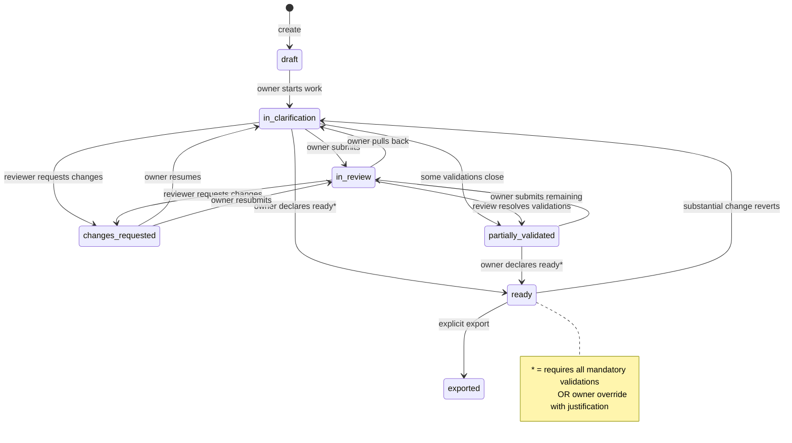

# EP-01 — Technical Design

## Domain Model

### WorkItem Entity

```python
# domain/models/work_item.py

class WorkItemState(str, Enum):
    DRAFT = "draft"
    IN_CLARIFICATION = "in_clarification"
    IN_REVIEW = "in_review"
    CHANGES_REQUESTED = "changes_requested"
    PARTIALLY_VALIDATED = "partially_validated"
    READY = "ready"
    EXPORTED = "exported"

class WorkItemType(str, Enum):
    IDEA = "idea"
    BUG = "bug"
    ENHANCEMENT = "enhancement"
    TASK = "task"
    INITIATIVE = "initiative"
    SPIKE = "spike"
    BUSINESS_CHANGE = "business_change"
    REQUIREMENT = "requirement"
    MILESTONE = "milestone"   # EP-14 hierarchy
    STORY = "story"           # EP-14 hierarchy

class DerivedState(str, Enum):
    IN_PROGRESS = "in_progress"
    BLOCKED = "blocked"
    READY = "ready"

@dataclass
class WorkItem:
    id: UUID
    title: str                         # 3–255 chars
    type: WorkItemType
    state: WorkItemState               # managed by state machine
    owner_id: UUID
    creator_id: UUID
    project_id: UUID
    description: str | None
    original_input: str | None
    priority: Priority | None
    due_date: date | None
    tags: list[str]
    completeness_score: int            # 0–100, computed
    parent_work_item_id: UUID | None   # EP-14: hierarchy parent; None = root node
    materialized_path: str             # EP-14: "" for root nodes; managed by MaterializedPathService
    attachment_count: int              # EP-16: denormalized; updated by AttachmentService
    has_override: bool
    override_justification: str | None
    owner_suspended_flag: bool
    created_at: datetime
    updated_at: datetime
    deleted_at: datetime | None
    exported_at: datetime | None
    export_reference: str | None

    # Computed at read time, never persisted
    @property
    def derived_state(self) -> DerivedState | None: ...

    # Domain methods
    def can_transition_to(self, target: WorkItemState, actor_id: UUID) -> tuple[bool, str]: ...
    def apply_transition(self, target: WorkItemState, actor_id: UUID, reason: str | None) -> StateTransition: ...
    def force_ready(self, actor_id: UUID, justification: str) -> StateTransition: ...
    def reassign_owner(self, new_owner_id: UUID, changed_by: UUID, reason: str | None) -> OwnershipRecord: ...
    def compute_completeness(self) -> int: ...
```

### Value Objects

```python
# domain/value_objects/transition.py

@dataclass(frozen=True)
class StateTransition:
    work_item_id: UUID
    from_state: WorkItemState
    to_state: WorkItemState
    actor_id: UUID
    triggered_at: datetime
    reason: str | None
    is_override: bool
    override_justification: str | None

# domain/value_objects/ownership_record.py

@dataclass(frozen=True)
class OwnershipRecord:
    work_item_id: UUID
    previous_owner_id: UUID
    new_owner_id: UUID
    changed_by: UUID
    changed_at: datetime
    reason: str | None
```

### State Machine Implementation

**Decision: custom FSM over a transitions library.**

Rationale:
- The transition rules are simple (15 valid edges, 1 entity type). A library like `python-statemachine` or `transitions` adds a dependency and an abstraction layer for a graph that fits in 30 lines.
- Business rules (content gate, validation checks, override) are orthogonal to the graph itself; they live in the service layer. The FSM only answers "is this edge valid?".
- Custom FSM is trivially testable with a dict of `{(from, to): True}`.

Alternative considered: `python-statemachine` library — rejected because it encourages putting business logic in callbacks, which bleeds into the domain model and makes testing brittle.

```python
# domain/state_machine.py

VALID_TRANSITIONS: frozenset[tuple[WorkItemState, WorkItemState]] = frozenset({
    (DRAFT, IN_CLARIFICATION),
    (IN_CLARIFICATION, IN_REVIEW),
    (IN_CLARIFICATION, CHANGES_REQUESTED),
    (IN_CLARIFICATION, PARTIALLY_VALIDATED),
    (IN_CLARIFICATION, READY),
    (IN_REVIEW, CHANGES_REQUESTED),
    (IN_REVIEW, PARTIALLY_VALIDATED),
    (IN_REVIEW, IN_CLARIFICATION),
    (CHANGES_REQUESTED, IN_CLARIFICATION),
    (CHANGES_REQUESTED, IN_REVIEW),
    (PARTIALLY_VALIDATED, IN_REVIEW),
    (PARTIALLY_VALIDATED, READY),
    (READY, EXPORTED),
    (READY, IN_CLARIFICATION),    # revert on substantial change
})
# 14 edges total. `derived_state` (in_progress/blocked/ready) is NOT an FSM state — it is
# materialized write-through (resolution #15) on transitions, validation changes, and review events.

def is_valid_transition(from_state: WorkItemState, to_state: WorkItemState) -> bool:
    return (from_state, to_state) in VALID_TRANSITIONS
```

---

## State Machine Diagram



---

## Database Schema

### `work_items` table

> **EP-01 owns the canonical `work_items` schema.** Every column below is listed explicitly.
> Other epics (EP-02 draft/template, EP-05 hierarchy, EP-06 override audit, EP-07 versioning,
> EP-09 dashboards, EP-11 Jira import, EP-14 hierarchy, EP-16 attachments) add behavior against
> these columns but do not redeclare the table.

```sql
CREATE TABLE work_items (
    id                      UUID PRIMARY KEY DEFAULT gen_random_uuid(),
    workspace_id            UUID NOT NULL REFERENCES workspaces(id),              -- multi-tenant RLS
    project_id              UUID,                                                 -- FK added by EP-10 (see note)
    type                    TEXT NOT NULL,                                        -- idea|bug|enhancement|task|initiative|spike|business_change|requirement|milestone|story
    title                   VARCHAR(255) NOT NULL,
    description             TEXT,
    original_input          TEXT,                                                 -- verbatim capture, preserved
    state                   TEXT NOT NULL DEFAULT 'draft',                        -- FSM state (lowercase snake_case)
    derived_state           TEXT,                                                 -- materialized write-through: in_progress|blocked|ready
    owner_id                UUID REFERENCES users(id),
    team_id                 UUID REFERENCES teams(id),                            -- EP-09 team filtering
    has_override            BOOLEAN NOT NULL DEFAULT FALSE,                       -- EP-06 audit
    override_justification  TEXT,
    override_by             UUID REFERENCES users(id),                            -- EP-06 (column lives here)
    override_at             TIMESTAMPTZ,                                          -- EP-06
    version_number          INTEGER NOT NULL DEFAULT 0,                           -- EP-03 optimistic lock
    current_version_id      UUID,                                                 -- EP-06 review pinning / EP-11 divergence
    state_entered_at        TIMESTAMPTZ NOT NULL DEFAULT now(),                   -- EP-09 dashboards
    due_date                DATE,                                                 -- resolution #15: deadline support
    imported_from_jira      BOOLEAN NOT NULL DEFAULT FALSE,                       -- resolution #12: Jira import flag
    jira_source_key         TEXT,                                                 -- original Jira issue key (if imported)
    parent_work_item_id     UUID REFERENCES work_items(id) ON DELETE RESTRICT,    -- EP-14 hierarchy
    materialized_path       TEXT NOT NULL DEFAULT '',                             -- EP-14 adjacency + path hybrid
    attachment_count        INTEGER NOT NULL DEFAULT 0,                           -- EP-16 denormalized
    draft_data              JSONB,                                                -- EP-02 auto-save payload
    template_id             UUID,                                                 -- FK set by EP-10 (templates)
    created_by              UUID NOT NULL REFERENCES users(id),
    created_at              TIMESTAMPTZ NOT NULL DEFAULT now(),
    updated_at              TIMESTAMPTZ NOT NULL DEFAULT now(),
    -- operational
    owner_suspended_flag    BOOLEAN NOT NULL DEFAULT FALSE,
    priority                VARCHAR(20),
    tags                    TEXT[] NOT NULL DEFAULT '{}',
    completeness_score      SMALLINT NOT NULL DEFAULT 0,
    deleted_at              TIMESTAMPTZ,
    exported_at             TIMESTAMPTZ,

    CONSTRAINT work_items_title_length CHECK (char_length(title) BETWEEN 3 AND 255),
    CONSTRAINT work_items_completeness_range CHECK (completeness_score BETWEEN 0 AND 100),
    CONSTRAINT work_items_type_valid CHECK (type IN (
        'idea','bug','enhancement','task','initiative','spike','business_change','requirement',
        'milestone','story'
    )),
    CONSTRAINT work_items_state_valid CHECK (state IN (
        'draft','in_clarification','in_review','changes_requested',
        'partially_validated','ready','exported'
    )),
    CONSTRAINT work_items_derived_state_valid CHECK (derived_state IS NULL OR derived_state IN (
        'in_progress','blocked','ready'
    ))
);

-- DROPPED (resolution #4 / #22): `aggregated_comment_text`, `aggregated_task_text` — no
-- denormalized search columns. All search delegated to Puppet (EP-13).

CREATE INDEX idx_work_items_project_state ON work_items(project_id, state) WHERE deleted_at IS NULL;
CREATE INDEX idx_work_items_owner ON work_items(owner_id) WHERE deleted_at IS NULL;
CREATE INDEX idx_work_items_updated ON work_items(updated_at DESC) WHERE deleted_at IS NULL;
CREATE INDEX idx_work_items_has_override ON work_items(has_override) WHERE has_override = TRUE AND deleted_at IS NULL;
CREATE INDEX idx_work_items_team ON work_items(team_id) WHERE deleted_at IS NULL;
CREATE INDEX idx_work_items_state_entered ON work_items(state_entered_at) WHERE deleted_at IS NULL;
CREATE INDEX idx_work_items_workspace_state ON work_items(workspace_id, state) WHERE deleted_at IS NULL;
CREATE INDEX idx_work_items_parent ON work_items(parent_work_item_id) WHERE parent_work_item_id IS NOT NULL AND deleted_at IS NULL;

-- Per db_review.md IDX-1: primary workspace-scoped listing index. Every list query
-- filters by workspace_id + state and orders by updated_at DESC. Partial on
-- deleted_at IS NULL keeps the index lean.
CREATE INDEX idx_work_items_ws_state_updated
    ON work_items(workspace_id, state, updated_at DESC)
    WHERE deleted_at IS NULL;

-- FK for current_version_id added in EP-07 migration (work_item_versions table created there):
-- ALTER TABLE work_items ADD CONSTRAINT fk_work_items_current_version
--     FOREIGN KEY (current_version_id) REFERENCES work_item_versions(id);

-- FK for project_id is added in EP-10 migration (projects table is created there):
-- ALTER TABLE work_items ADD CONSTRAINT fk_work_items_project
--     FOREIGN KEY (project_id) REFERENCES projects(id);
-- project_id is declared NULLABLE in EP-01 because EP-01 runs at migration position 2
-- while EP-10 (which creates `projects`) runs at position 10. Declaring a NOT NULL FK here
-- would fail migration (`relation "projects" does not exist`). The application layer enforces
-- that project_id is set before any transition OUT of Draft — WorkItemFSMService rejects the
-- transition with VALIDATION_PROJECT_REQUIRED if project_id IS NULL.
--
-- workspace_id is denormalized (also present on projects) so workspace-scoped queries
-- do not need a JOIN through projects on every request. It is NOT NULL at creation
-- because a work item always belongs to a workspace (never orphaned).
```

### `state_transitions` table (audit)

```sql
CREATE TABLE state_transitions (
    id                      UUID PRIMARY KEY DEFAULT gen_random_uuid(),
    work_item_id            UUID NOT NULL REFERENCES work_items(id),
    from_state              VARCHAR(50) NOT NULL,
    to_state                VARCHAR(50) NOT NULL,
    actor_id                UUID REFERENCES users(id),   -- NULL when actor = system
    triggered_at            TIMESTAMPTZ NOT NULL DEFAULT now(),
    transition_reason       TEXT,
    is_override             BOOLEAN NOT NULL DEFAULT FALSE,
    override_justification  TEXT
);

CREATE INDEX idx_state_transitions_work_item ON state_transitions(work_item_id, triggered_at DESC);
```

### `ownership_history` table (audit)

```sql
CREATE TABLE ownership_history (
    id                  UUID PRIMARY KEY DEFAULT gen_random_uuid(),
    work_item_id        UUID NOT NULL REFERENCES work_items(id),
    previous_owner_id   UUID NOT NULL REFERENCES users(id),
    new_owner_id        UUID NOT NULL REFERENCES users(id),
    changed_by          UUID NOT NULL REFERENCES users(id),
    changed_at          TIMESTAMPTZ NOT NULL DEFAULT now(),
    reason              TEXT
);

CREATE INDEX idx_ownership_history_work_item ON ownership_history(work_item_id, changed_at DESC);
```

---

## Application Layer

### WorkItemService (application/services/work_item_service.py)

Responsibilities:
- Orchestrate domain entity + repository + event emission
- Enforce business rules that cross-cut domain objects (e.g., check mandatory validations before transition)
- No direct DB access; delegates to repository

Key methods:
```python
async def create_work_item(command: CreateWorkItemCommand) -> WorkItem
async def get_work_item(item_id: UUID, requester_id: UUID) -> WorkItem
async def list_work_items(project_id: UUID, requester_id: UUID, filters: WorkItemFilters) -> Page[WorkItem]
async def update_work_item(item_id: UUID, command: UpdateWorkItemCommand, actor_id: UUID) -> WorkItem
async def delete_work_item(item_id: UUID, actor_id: UUID) -> None
async def transition_state(item_id: UUID, target: WorkItemState, actor_id: UUID, reason: str | None) -> WorkItem
async def force_ready(item_id: UUID, actor_id: UUID, justification: str, confirmed: bool) -> WorkItem
async def reassign_owner(item_id: UUID, new_owner_id: UUID, actor_id: UUID, reason: str | None) -> WorkItem
```

### Validation hook design

Before transitioning to `ready` (non-override), the service calls `ValidationRepository.get_pending_mandatory(work_item_id)`. If non-empty, raises `MandatoryValidationsPendingError`. This keeps the state machine pure and the business rule in the service.

### Cross-epic column responsibilities

| Column | Updated by | When |
|--------|------------|------|
| `state_entered_at` | FSM service (`transition_state`, `force_ready`) | Every successful state transition — set to `NOW()` |

**Enforcement note**: `state_entered_at` cannot be enforced by a CHECK constraint (CHECK cannot
reference other columns' NEW vs OLD state transitions). It is enforced by convention: the
`TransitionService` is the single writer of `work_items.state` and is responsible for updating
`state_entered_at` in the same UPDATE statement / transaction as the `state` column change.
No other service or repository may write to `state` directly. Code review MUST reject any
direct UPDATE to `work_items.state` that bypasses `TransitionService`. A database trigger
is explicitly rejected here to keep state transition side effects (timeline events, versioning,
notifications) co-located in the application service layer.
| `version_number` | EP-07 versioning service | Whenever a new `work_item_version` is created; the FSM never touches this column |
| `current_version_id` | EP-07 versioning service | Whenever a new `work_item_version` is created; points to the latest version snapshot |
| `override_by` / `override_at` | FSM service (`force_ready`) | Set atomically with `has_override = TRUE` on force-ready |
| `team_id` | WorkItemService (`create_work_item`, `update_work_item`) | Set at creation or on explicit team assignment |
| `parent_work_item_id` | WorkItemService (`create_work_item`, `update_work_item`) | Validated by EP-14's `HierarchyValidator.validate_parent()` before persistence; type-compatibility rules enforced before any DB write |
| `materialized_path` | EP-14's `MaterializedPathService` | Computed on create; subtree-updated via recursive CTE on reparent. Empty string for root nodes. |
| `attachment_count` | EP-16's `AttachmentService` | Denormalized count incremented/decremented on attach/detach/soft-delete. Used by list view to show paperclip icon without join. |

---

## API Endpoints

All endpoints under `/api/v1/`.

| Method | Path | Description | Auth |
|--------|------|-------------|------|
| POST | `/work-items` | Create work item | JWT |
| GET | `/work-items/{id}` | Get work item | JWT |
| GET | `/projects/{project_id}/work-items` | List (paginated) | JWT |
| PATCH | `/work-items/{id}` | Update fields | JWT |
| DELETE | `/work-items/{id}` | Soft delete (draft only) | JWT (owner) |
| POST | `/work-items/{id}/transitions` | State transition | JWT |
| POST | `/work-items/{id}/force-ready` | Override to ready | JWT (owner) |
| PATCH | `/work-items/{id}/owner` | Reassign owner | JWT (owner or admin) |
| GET | `/work-items/{id}/transitions` | Audit trail | JWT |
| GET | `/work-items/{id}/ownership-history` | Ownership audit | JWT |

### Request: POST /work-items/{id}/transitions

```json
{
  "target_state": "in_review",
  "reason": "optional context"
}
```

### Request: POST /work-items/{id}/force-ready

```json
{
  "justification": "Shipping this week, security review deferred to post-launch",
  "confirmed": true
}
```

### Response envelope

Success:
```json
{ "data": { ...work_item... }, "message": "State transitioned to in_review" }
```

Error:
```json
{ "error": { "code": "INVALID_TRANSITION", "message": "...", "details": { "from_state": "draft", "to_state": "in_review" } } }
```

---

## Domain Events

| Event | Payload | Trigger |
|-------|---------|---------|
| `work_item.created` | item_id, type, owner_id, project_id | Creation |
| `work_item.state_changed` | item_id, from, to, actor_id | Any valid transition |
| `work_item.ready_override` | item_id, actor_id, justification, skipped_validations | force-ready |
| `work_item.reverted_from_ready` | item_id, trigger | Substantial content change |
| `work_item.owner_changed` | item_id, prev_owner_id, new_owner_id, changed_by | Reassignment |
| `work_item.changes_requested` | item_id, reviewer_id, reason | Reviewer action |
| `work_item.content_changed_after_ready` | item_id, changed_fields | Content update on ready item |
| `workspace.member_suspended_with_active_items` | user_id, item_ids | Member suspension with active ownership |

Events are emitted via in-process event bus in the application service layer. Celery consumes async events (notifications, derived state refresh).

---

## Completeness Score Algorithm

Computed synchronously on every save. Weights:

| Factor | Weight |
|--------|--------|
| Title non-empty | 10 |
| Description non-empty | 15 |
| Original input preserved | 10 |
| Type-relevant fields filled (varies) | 25 |
| Owner assigned (always true post-creation, partial credit if suspended) | 10 |
| Mandatory validations resolved | 20 |
| Next step computable | 10 |

Score below 30 blocks `derived_state = ready` regardless of primary state.

The exact type-relevant field check is a strategy per `WorkItemType` — a dict mapping type to a callable that evaluates the item and returns 0–25. This stays in domain, not service layer.

---

## Alternatives Considered

### State machine library (python-statemachine / transitions)

Rejected. Both libraries conflate graph definition with callback hooks. Business rules (mandatory validation check, content gate) end up in `on_enter_ready` style callbacks which are invisible at the service boundary and hard to test in isolation. The FSM here is 14 edges; a dict is simpler and more transparent.

### Storing derived_state in the DB

**Decision (resolved 2026-04-14, resolution #15)**: **materialize `derived_state` write-through**. The column lives on `work_items` and is updated atomically by the service layer on every state transition, validation change, and review event. Read paths (list-view perf, dashboards) get O(1) lookup without computing from blocking conditions on each query.

Invariants:
- `derived_state` is ONLY written by `TransitionService`, `ValidationService`, and `ReviewService` — never directly by controllers or repositories.
- Any code path that can change a blocking condition (pending validation, review outcome, override) MUST recompute and persist `derived_state` in the same transaction.
- Rebuild routine available for data backfill / correctness audits.

### Separate tables per item type

Rejected. All 8 types share the same lifecycle and 90% of the same fields. Type-specific template and completeness behavior lives in application/domain logic, not schema. One table is maintainable; 8 tables create JOIN nightmares and migration burden.

### Event sourcing for state transitions

Overkill at current scale. The `state_transitions` audit table gives us full history. Rebuilding state from events adds complexity without value at this scale. Revisit if we need time-travel queries or complex projections. ⚠️ originally MVP-scoped — see decisions_pending.md
