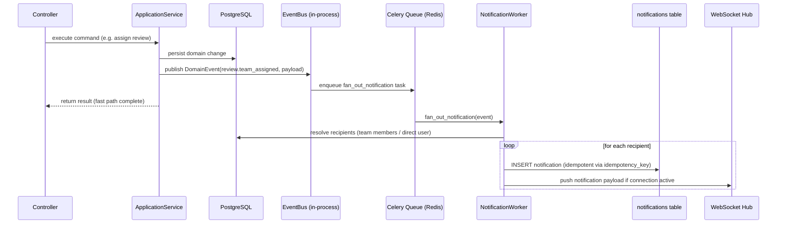

# EP-08 — Technical Design: Teams, Assignments, Notifications & Inbox

## Domain Model

### Team

```
Team
  id: UUID (PK)
  workspace_id: UUID (FK)
  name: str (unique within workspace)
  description: str | None
  status: TeamStatus  # active | deleted
  can_receive_reviews: bool
  created_at: datetime
  updated_at: datetime
  created_by: UUID (FK -> users)
```

### TeamMembership

```
TeamMembership
  id: UUID (PK)
  team_id: UUID (FK -> teams)
  user_id: UUID (FK -> users)
  role: TeamRole  # member | lead
  joined_at: datetime
  removed_at: datetime | None  # soft delete
```

### Notification

```
Notification
  id: UUID (PK)
  workspace_id: UUID (FK)
  recipient_id: UUID (FK -> users)
  type: NotificationType  # enum — see triggering events table in spec
  state: NotificationState  # unread | read | actioned
  actor_id: UUID | None  # who triggered the event
  subject_type: str  # "work_item" | "review" | "block" | "team"
  subject_id: UUID
  deeplink: str  # /items/{id} or /items/{id}/reviews/{review_id}
  quick_action: JSONB | None  # {action: str, endpoint: str, method: str, payload_schema: dict}
  extra: JSONB  # additional context (team_id for team reviews, etc.)
  idempotency_key: str  # (recipient_id, domain_event_id) — unique constraint
  created_at: datetime
  read_at: datetime | None
  actioned_at: datetime | None
```

### InboxItem (computed — not a persisted entity)

```
InboxItem (view/query result)
  item_id: UUID
  item_type: str
  item_title: str
  owner_id: UUID
  current_state: str
  priority_tier: int  # 1-4
  tier_label: str
  event_age: datetime  # created_at of triggering event
  deeplink: str
  quick_action: JSONB | None
  source: str  # "direct" | "team"
  team_id: UUID | None
```

---

## DB Schema

```sql
-- teams
CREATE TABLE teams (
    id UUID PRIMARY KEY DEFAULT gen_random_uuid(),
    workspace_id UUID NOT NULL REFERENCES workspaces(id),
    name VARCHAR(255) NOT NULL,
    description TEXT,
    status VARCHAR(20) NOT NULL DEFAULT 'active',  -- active | deleted
    can_receive_reviews BOOLEAN NOT NULL DEFAULT false,
    created_at TIMESTAMPTZ NOT NULL DEFAULT now(),
    updated_at TIMESTAMPTZ NOT NULL DEFAULT now(),
    created_by UUID NOT NULL REFERENCES users(id),
    UNIQUE (workspace_id, name)
);
CREATE INDEX idx_teams_workspace_status ON teams(workspace_id, status);

-- team_memberships
CREATE TABLE team_memberships (
    id UUID PRIMARY KEY DEFAULT gen_random_uuid(),
    -- Per db_review.md DI-6: missing ON DELETE policy. CASCADE so deleting a team
    -- cleans up its membership rows. Teams can be hard-deleted in MVP (no soft delete).
    team_id UUID NOT NULL REFERENCES teams(id) ON DELETE CASCADE,
    user_id UUID NOT NULL REFERENCES users(id) ON DELETE CASCADE,
    role VARCHAR(20) NOT NULL DEFAULT 'member',  -- member | lead
    joined_at TIMESTAMPTZ NOT NULL DEFAULT now(),
    removed_at TIMESTAMPTZ
);
CREATE UNIQUE INDEX idx_team_memberships_active
    ON team_memberships(team_id, user_id)
    WHERE removed_at IS NULL;
CREATE INDEX idx_team_memberships_user ON team_memberships(user_id) WHERE removed_at IS NULL;

-- notifications
CREATE TABLE notifications (
    id UUID PRIMARY KEY DEFAULT gen_random_uuid(),
    -- Per db_review.md DI-7: workspace deletion must cascade to notifications.
    workspace_id UUID NOT NULL REFERENCES workspaces(id) ON DELETE CASCADE,
    recipient_id UUID NOT NULL REFERENCES users(id) ON DELETE CASCADE,
    type VARCHAR(50) NOT NULL,
    state VARCHAR(20) NOT NULL DEFAULT 'unread',  -- unread | read | actioned
    actor_id UUID REFERENCES users(id),
    subject_type VARCHAR(50) NOT NULL,
    subject_id UUID NOT NULL,
    deeplink TEXT NOT NULL,
    quick_action JSONB,
    extra JSONB NOT NULL DEFAULT '{}',
    idempotency_key VARCHAR(255) NOT NULL,
    created_at TIMESTAMPTZ NOT NULL DEFAULT now(),
    read_at TIMESTAMPTZ,
    actioned_at TIMESTAMPTZ,
    UNIQUE (idempotency_key)
);
CREATE INDEX idx_notifications_recipient_state
    ON notifications(recipient_id, state, created_at DESC);
CREATE INDEX idx_notifications_recipient_unread
    ON notifications(recipient_id) WHERE state = 'unread';

-- Per db_review.md IDX-3: unread count badge query filters (recipient_id, workspace_id)
-- and is called on every page load. Partial index on state='unread' keeps the index tiny.
CREATE INDEX idx_notifications_unread_count
    ON notifications(recipient_id, workspace_id)
    WHERE state = 'unread';
```

Note: InboxItem is not persisted. It is computed via UNION query across work_items and reviews tables filtered by user context. See Inbox Aggregation below.

---

## Event-Driven Notification Architecture

Domain events are published in-process after successful DB commits. The notification service subscribes and fans out to recipients. Fan-out runs asynchronously via Celery to keep request latency low.

### Flow



### Key design decisions

- **In-process event bus** (simple list of handlers, not a broker) for synchronous dispatch. The event is enqueued to Celery immediately — no distributed message broker needed at MVP scale.
- **Celery + Redis** for fan-out. This decouples notification latency from request latency. If a team has 50 members, we do not block the HTTP response on 50 INSERTs.
- **Idempotency key** = `sha256(recipient_id + domain_event_id)`. Celery retries are safe.
- **No email or push at MVP**. Internal only. WebSocket/SSE for real-time. Persistent DB for history.

---

## Inbox Aggregation Query Strategy

The inbox is computed, not materialized. Four sub-queries UNION'd with a priority tier column.

All branches filter on `workspace_id` to enforce workspace isolation. `NOT EXISTS` is used throughout instead of `NOT IN` to avoid NULL-matching pitfalls and enable anti-join optimization. Each branch is `LIMIT 50` to bound the result set per tier.

```sql
-- Tier 1a: pending reviews assigned directly to user
SELECT wi.id, wi.type, wi.title, wi.owner_id, rr.status, 1 AS tier,
       'Pending reviews' AS tier_label, rr.created_at AS event_age,
       rr.id AS review_request_id, NULL::uuid AS team_id, 'direct' AS source
FROM review_requests rr
JOIN work_items wi ON wi.id = rr.work_item_id
WHERE rr.reviewer_id = :user_id
  AND rr.reviewer_type = 'user'
  AND rr.status = 'pending'
  AND rr.workspace_id = :workspace_id
LIMIT 50

UNION ALL

-- Tier 1b: pending reviews assigned to user's teams (not yet resolved by a teammate)
SELECT wi.id, wi.type, wi.title, wi.owner_id, rr.status, 1,
       'Pending reviews', rr.created_at, rr.id, rr.team_id, 'team'
FROM review_requests rr
JOIN work_items wi ON wi.id = rr.work_item_id
JOIN team_memberships tm ON tm.team_id = rr.team_id
    AND tm.user_id = :user_id
    AND tm.removed_at IS NULL
WHERE rr.reviewer_type = 'team'
  AND rr.status = 'pending'
  AND rr.workspace_id = :workspace_id
  AND NOT EXISTS (
      SELECT 1 FROM review_responses resp
      WHERE resp.review_request_id = rr.id
  )
LIMIT 50

UNION ALL

-- Tier 2: work items owned by user with changes requested
SELECT id, type, title, owner_id, state, 2, 'Changes requested',
       updated_at, NULL::uuid, NULL::uuid, 'direct'
FROM work_items
WHERE owner_id = :user_id
  AND state = 'changes_requested'
  AND workspace_id = :workspace_id
  AND deleted_at IS NULL
LIMIT 50

UNION ALL

-- Tier 3: work items where user's review response requested changes and review is unresolved
SELECT wi.id, wi.type, wi.title, wi.owner_id, wi.state, 3, 'Pending my feedback',
       resp.created_at, rr.id, NULL::uuid, 'direct'
FROM review_responses resp
JOIN review_requests rr ON rr.id = resp.review_request_id
JOIN work_items wi ON wi.id = rr.work_item_id
WHERE resp.responder_id = :user_id
  AND resp.decision = 'changes_requested'
  AND rr.status = 'pending'
  AND wi.workspace_id = :workspace_id
  AND wi.deleted_at IS NULL
  AND NOT EXISTS (
      SELECT 1 FROM review_requests rr2
      WHERE rr2.id = rr.id
        AND rr2.status IN ('approved', 'rejected')
  )
LIMIT 50

UNION ALL

-- Tier 4: work items owned by user in early states below completeness threshold
SELECT id, type, title, owner_id, state, 4, 'Needs attention',
       updated_at, NULL::uuid, NULL::uuid, 'direct'
FROM work_items
WHERE owner_id = :user_id
  AND state IN ('draft', 'in_clarification')
  AND workspace_id = :workspace_id
  AND deleted_at IS NULL
  AND completeness_score < 50
LIMIT 50

ORDER BY tier ASC, event_age ASC;
```

**Indexes required** (on top of what EP-01 provides):
- `review_requests(reviewer_id, status)` — partial index WHERE reviewer_id IS NOT NULL AND status = 'pending'
- `review_requests(team_id, status)` — partial index WHERE reviewer_type = 'team' AND status = 'pending'
- `work_items(owner_id, state, workspace_id)` — composite WHERE deleted_at IS NULL
- `review_responses(responder_id, decision)` — composite

De-duplication (item in multiple tiers): handled at application layer — after fetching, group by item_id and keep lowest tier value.

---

## API Endpoints

### Teams

| Method | Path | Description |
|---|---|---|
| POST | /api/v1/teams | Create team |
| GET | /api/v1/teams | List teams (workspace-scoped) |
| GET | /api/v1/teams/{team_id} | Get team detail with members |
| PATCH | /api/v1/teams/{team_id} | Update name, description, can_receive_reviews |
| DELETE | /api/v1/teams/{team_id} | Logical delete |
| POST | /api/v1/teams/{team_id}/members | Add member |
| DELETE | /api/v1/teams/{team_id}/members/{user_id} | Remove member |
| PATCH | /api/v1/teams/{team_id}/members/{user_id}/role | Update role (lead/member) |

### Notifications

| Method | Path | Description |
|---|---|---|
| GET | /api/v1/notifications | List notifications (user-scoped, paginated) |
| GET | /api/v1/notifications/unread-count | Lightweight badge count |
| PATCH | /api/v1/notifications/{notification_id}/read | Mark single as read |
| POST | /api/v1/notifications/mark-all-read | Bulk mark read |
| POST | /api/v1/notifications/{notification_id}/action | Execute quick action |

### Inbox

| Method | Path | Description |
|---|---|---|
| GET | /api/v1/inbox | Get aggregated inbox (user-scoped, grouped by tier) |
| GET | /api/v1/inbox/count | Badge count per tier + total |

### Assignments

| Method | Path | Description |
|---|---|---|
| PATCH | /api/v1/items/{item_id}/owner | Assign owner to item |
| POST | /api/v1/items/{item_id}/reviews | Create review (includes reviewer assignment) |
| GET | /api/v1/items/{item_id}/suggested-reviewer | Get routing rule suggestion |
| GET | /api/v1/items/{item_id}/suggested-owner | Get default owner suggestion |
| POST | /api/v1/items/bulk-assign | Batch owner assignment |

### Real-Time

| Method | Path | Description |
|---|---|---|
| GET | /api/v1/notifications/stream | SSE stream for real-time delivery |

---

## Real-Time Delivery: SSE vs WebSocket vs Polling

**Decision: SSE (Server-Sent Events)**

Rationale:
- Notifications are server-to-client only. No client-to-server messages needed over the real-time channel. SSE is the correct primitive for unidirectional push.
- SSE works over plain HTTP/1.1, no upgrade handshake, trivially proxy-friendly, auto-reconnects natively in browsers.
- WebSocket is overkill — adds bidirectional complexity we do not use. Save it for collaborative editing (future EP).
- Polling is rejected — adds unnecessary load and latency for an action-hub feature.

SSE endpoint: `GET /api/v1/notifications/stream`
- Auth: Use stream-token pattern defined in EP-12 SSE Authentication section. Client calls `POST /api/v1/sse/stream-token` first, then opens SSE with `Authorization: Bearer <stream_token>`. **Never pass tokens as query parameters** — they appear in proxy logs.
- Events emitted: `notification_created` (payload: full notification object), `inbox_count_updated` (payload: `{total, by_tier}`).
- Connection managed in FastAPI with `async for` generator. Redis pub/sub channel per user: `sse:user:{user_id}`.
- The Celery worker publishes to Redis after each fan-out INSERT. The SSE handler subscribes and forwards.

### SSE Channel Authorization (HIGH-1 fix)

`SseHandler.stream()` MUST verify the authenticated user is authorized to subscribe to the requested channel before opening the Redis subscription. Unauthorized subscription attempts return 403.

| Channel pattern | Authorization rule |
|----------------|--------------------|
| `sse:user:{user_id}` | Only the user whose `user_id` matches `current_user.id`. Reject if mismatch. |
| `sse:workspace:{workspace_id}` | Only active members of that workspace. Verify via `workspace_member_repo.get(workspace_id, current_user.id)`. |
| `sse:work_item:{item_id}` | Only users with view access to the item (same workspace check via `WorkspaceScopedRepository`). |

Rejection response: HTTP 403 `{ "error": { "code": "SSE_CHANNEL_FORBIDDEN" } }`. The 403 is returned before any Redis subscription is opened.

---

## DDD Layer Mapping

```
domain/
  models/
    team.py              # Team, TeamMembership entities
    notification.py      # Notification entity + enums
  repositories/
    team_repository.py   # ITeamRepository interface
    notification_repository.py
    inbox_repository.py  # IInboxRepository — get_inbox(user_id, workspace_id) -> list[InboxItem] (Fixed per backend_review.md LV-3)
  events/
    team_events.py       # TeamMemberAdded, TeamReviewAssigned, etc.
    notification_events.py

application/
  services/
    team_service.py      # Team CRUD + member management
    notification_service.py  # Fan-out orchestration
    inbox_service.py     # Inbox orchestration — calls InboxRepository, handles de-duplication (Fixed per backend_review.md LV-3: SQL UNION moved to repository)
    assignment_service.py    # Owner + reviewer assignment + suggestions

infrastructure/
  persistence/
    team_repository.py   # SQLAlchemy impl
    notification_repository.py
    inbox_repository_impl.py  # UNION SQL lives here, not in InboxService (Fixed per backend_review.md LV-3)
  adapters/
    sse_publisher.py     # Redis pub/sub push
    celery_tasks.py      # fan_out_notification task

presentation/
  controllers/
    team_controller.py
    notification_controller.py
    inbox_controller.py
    assignment_controller.py
    sse_controller.py
```

---

## Risks and Mitigations

| Risk | Mitigation |
|---|---|
| Notification fatigue kills adoption | Notification type preferences per user; suppress duplicate events within 5-min window for same subject |
| Inbox query p99 > 300ms with large data | Indexes per tier query; partial indexes on state; EXPLAIN ANALYZE before merge |
| Team review race condition (two members respond simultaneously) | DB-level `SELECT FOR UPDATE` on review row before state transition; first commit wins |
| Celery fan-out fails midway (partial delivery) | Idempotency key ensures retry completes without duplicates; dead-letter queue for failed tasks — DLQ MUST be configured in EP-12 Celery config (Fixed per backend_review.md CA-2): Celery default on `max_retries` exceeded is `MaxRetriesExceededError` to `failed` state only; a persistent DLQ requires `on_failure` handler publishing to a `dead_letter` queue defined in Celery config |
| SSE connection count at scale | Redis pub/sub scales horizontally; SSE connections are cheap (no full TCP handshake per message); revisit at >1k concurrent users |
